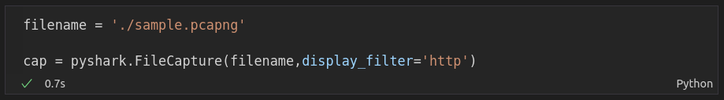

# CN Lab Mini Project

## To run
```
git clone https://github.com/divyashreedivya/cookie-capture.git
python3 -m venv env     #Create virtual env
source env/bin/activate     #Activate env
pip install -r requirements.txt    #Install the requirements
```

## Input
Input the required filename


## Output
The code outputs the following:
- Cookie
- Server/Host
- Source address
- Destination address
